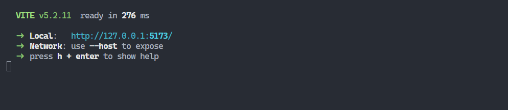

# Frontend Haciendola - prueba tecnica

para poder utilizar el sistema se debe tener instalado react y en una terminal escribir el siguiente comando:

```
npm install 
```

Con esto instalaremos las dependencias, una vez instaladas usamos el comando 

```
npm run dev
```

Esto iniciará el sistema frontend y nos brindara una url como esta:



Accedemos a la url y podremos utilizar el sistema.